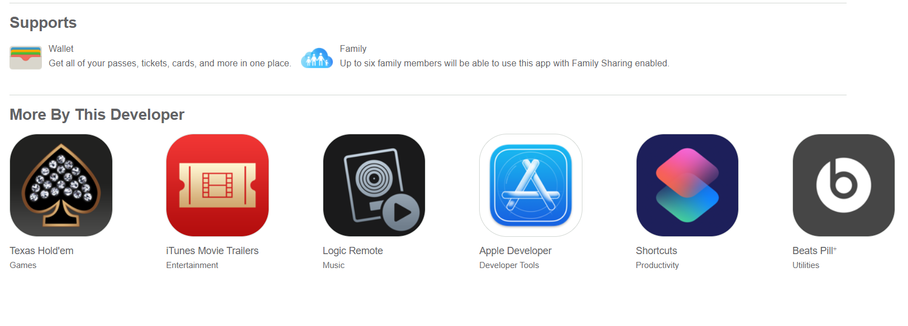

# Apple's App Store Review

Replication of [Apple's App Store Review](https://apps.apple.com/ca/app/apple-store/id375380948#?platform=iphone). Also added form where you can post your own review. Reviews are stored as a JSON database online and deleted automatically after a certain amount of time

Developed with React, Typescript, Redux, Jest, Enzyme, React-Testing-Library, JS, HTML, CSS, [Express using JSON-server library to connect our JSON database and app together](https://github.com/typicode/json-server).

# Why I Built It And What I've Learned:

-   To understand why we test and what we should test.
-   Knowing the difference between unit testing, integration tests, and black box functional testing.
-   The difference between Enzyme and React-Testing-Library.

## Why Spend Time On Testing:

-   Testing acts as documentation. A test describes how a code is supposed to function without needing to look at the source code, which could be far more complex and time-consuming. A test will break if it's not updated, hence a test is always up to date and can always be trusted.
-   Testing allows us to see what bugs can appear, allowing us to see if our app is working as intended.
-   Testing enforces us to think about edge cases that could break the app.
-   Tests are "guidance" for developers. When developers alter the source code like adding features or refactoring, the test can break and will tell us how the code is supposed to work; preventing further issues to develop.

## Different Types of Testing:

-   Unit Test: Testing only 1 thing. Such as clicking a button from <ComponentA> and seeing if <ComponentA> changes.
-   Integration Test: Testing multiple things. Such as clicking a button from <ComponentA> and seeing if it alters the DOM of <ComponentB>.
-   Blackbox Functional Testing (Paradigm behind React-Testing-Library): Instead of relying on the internal structure of the tested item, we test its functionality. Hence in React Testing Library, we test what the end-user sees, the full DOM; rather than testing specific components.
-   End to end testing: Testing the flow of the application from start to finish. Cypress is a popular framework for so. It is not included in this project.

## Enzyme:

-   Tests the internal structures of the component, which makes the tests very brittle from change. Relies on class, id selectors, which can be easily altered. For example, wrapper.find(".className"), is an example of Enzyme relying on the internal structure of the component.
-   Tests implementation details of our Redux Store (Action creators and reducers); end-user does not care what our action creators and reducers generate.
-   Support for newer React features proved to be a problem. In this project, shallow was not working in certain cases (resorted to mount) with Redux 7 and Enzyme 16. Had to downgrade to Redux 5.
-   3 types of rendering: **Shallow, Mount, and Render**.
-   **shallow(..)** renders the child <component> inside the component but it does not render what's inside the child <component>. Shallow is used to unit test because we isolate everything except the component in <Shallow>.
-   **mount(..)** for full DOM rendering. Used if we need to access the DOM of our child components or use lifecycle methods. Mount is used for integration tests.
-   **render(..)** renders the static HTML. Used to analyze the HTML strucutre.

## React Testing Library:

-   Does **not** test the internal structures of the component; tests the functionality of the rendered app. We test what the end user sees. This allows us to write tests that are not brittle from change (eg; test that will work even after a className is removed from a <div> by using getByText(/hello/i), getByTestId("idName"), etc); and we spend less time testing on "trivial" tests, such as, testing our action creators and reducers.
-   Indirectly enforces us to write semantic and accesible HTML so that it can be used in our testing. Library offers various ways to select the DOM without resorting to getByTestId(..).
-   Built on top of react-dom and react-dom/test-utils; this it supports new React Features. Library is reliable.

## External resources:

-   Prettier to format code and EsLint for linting.
-   Redux dev tool google chrome extension to check the values of the states.
-   JSON-server for a local database.

## What It Looks Like




# Getting Started

These instructions will get you a copy of the project up and running on your local machine for development and testing purposes.

1. Clone the project. Use `npm install` to install all the dependencies. Run the project with `npm start` for development or `npm run build` for production.

2. OPTIONAL: If you want to make changes locally, on the terminal, go to the `backend` directory. Type `npm start` to start the local JSON-server server/api which will connect the front-end to the database. Type `npm run start:json` to turn on the local JSON database. Then change the axiosConfig route file to http://localhost:3000.

# Prerequisites

What things you need to install the software

```
- Any package manager (npm, yarn)
```

# Versioning

None
